# COB Calculator: domain overview for review

**Audience:** lending and Credit Ops staff reviewing how the Cost of Borrowing (COB) calculator works. It is not a developer document.
**State:** 2026-10-01, after every planned item (B19 to B28, A11, A14) was delivered. Nothing is planned any more, so every box below is **today** or **open**. How each change came about is in `COB-ts/CHANGES.md`; this page does not repeat it.

## How to read this

Read top to bottom: what the calculator does (§1), the use cases (§2), the calculation (§3), where it differs from Excel (§4), and what we ask you to confirm (§5). Boxes are coloured: green is how it works **today**; grey is **open** (undecided, so today's rule is shown); white dashed is **outside** this tool. A reference such as `OQ-X` or `FB-16` names the decision it comes from; you need not look it up. Amounts are calculated at full precision and rounded only for display (2 decimals for dollars).

### Legend

```mermaid
flowchart LR
    T["Today: how the calculator works now"]:::today
    P["Planned: decided, not yet built (B-item)"]:::planned
    W["Known wrong result today"]:::wrong
    O["Open or on hold: not decided"]:::open
    X["Out of scope: not part of this calculator (BRD)"]:::out
    T --- P
    P -.- W
    W --- O
    O --- X
    classDef today fill:#e6f4ea,stroke:#1e7e34,color:#111
    classDef planned fill:#fff4e5,stroke:#d97706,stroke-dasharray:5 5,color:#111
    classDef wrong fill:#fde8e8,stroke:#c0392b,stroke-width:2px,color:#111
    classDef open fill:#eeeeee,stroke:#666,stroke-dasharray:2 2,color:#111
    classDef out fill:#ffffff,stroke:#999,stroke-dasharray:4 4,color:#555
```

Dashed arrows (`-.->`) show a planned path; solid arrows show today's path. White dashed boxes are out of scope for this calculator, per the BRD.

### Glossary

| Term | Meaning in this calculator |
|---|---|
| **Use case** | What the calculation is for. The screen calls it "Flow" and offers three: New mortgage/loan, Renewal, Payment change. A fourth, Variable rate payment change (VRPC), is hidden behind a switch (default off); its calculation is unchanged. |
| **Contract rate / Calculated rate** | Contract rate: the annual rate as entered. Calculated rate: the rate the schedule uses (§3.2). |
| **Start date** | Where interest starts: Disbursal date (New), Renewal date (Renewal), Date of change (Payment change, VRPC). |
| **Waterfall** | How each payment is applied: interest first, then principal (BR-13). |
| **Unpaid interest** | Interest a payment did not cover. It is held aside, outside the balance, and earns no interest. |
| **Accrued interest** (input) | Renewal, Payment change and VRPC only: interest already owed at the start. Paid first; earns no interest (IN-11). |
| **Fees** | Every fee entered is paid separately by the member: never in the balance or the payments, counted only in C. |
| **C** | Cost of borrowing amount: total interest + all fees. |
| **COB rate** | C ÷ (T × P) × 100, where T is the term in years and P the average balance (§3.5). |
| **Trigger rate** | Mortgage + variable only (Payment change too, once Accrued interest is entered): payment × payments per year ÷ Loan amount × 100. The rate above which the payment no longer covers the interest. |

---

## 1. What the calculator does

### 1.1 Scope

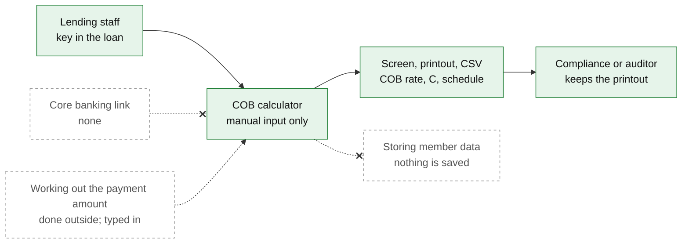

Sources: BRD §1.2, §2, §7. The CSV holds the payment schedule only, not the inputs or results. The schedule table on screen updates as you type; the printed table is built when you print.

### 1.2 One calculation

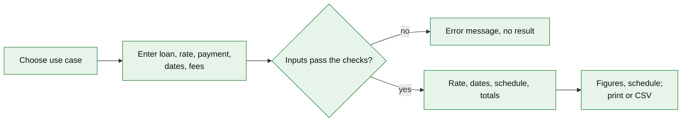

Source: `cobCanada.ts` (checks run before any calculation). Error wording is interim (Q-MSG, open).

---

## 2. The use cases

### 2.1 What each one asks for

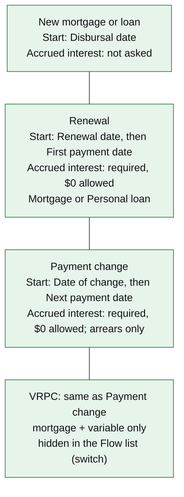

Every use case also asks for product type, rate type, contract rate, Loan amount, payment amount, payment frequency, First payment date, End date and fees. For Renewal, Payment change and VRPC, the Loan amount is the balance on the start date. A personal loan is Monthly only, in every use case (FB-24). Sources: `flows.ts`, `validate.ts`; decisions 2, 4, 5, 9 and the 2026-10-01 changes (CHANGES §59, §60).

### 2.2 Payment change: which date, and what "Accrued interest" holds

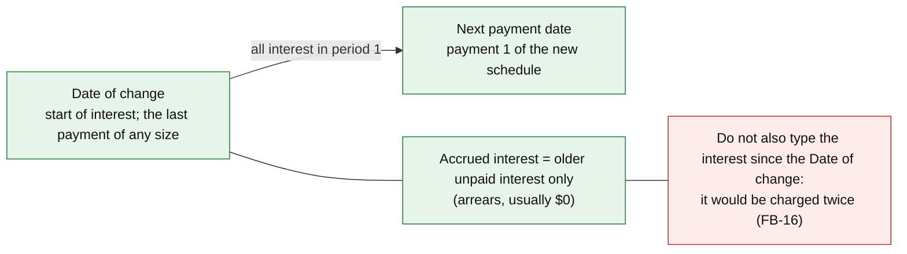

Worked example (FB-16, QA's figures, not re-run for this page): variable mortgage, $250,000 at 5.19%, monthly $1,500, one $250 fee, Date of change 2027-01-01, next payment 2027-02-01, accrued $0: C $37,970.45, COB rate 5.2194%. Typing the 19 days already charged ($675.41) as well gives C $38,754.64, the double count. The only guard against it is the arrears hint on screen and the user manual.

---

## 3. The calculation

### 3.1 End to end

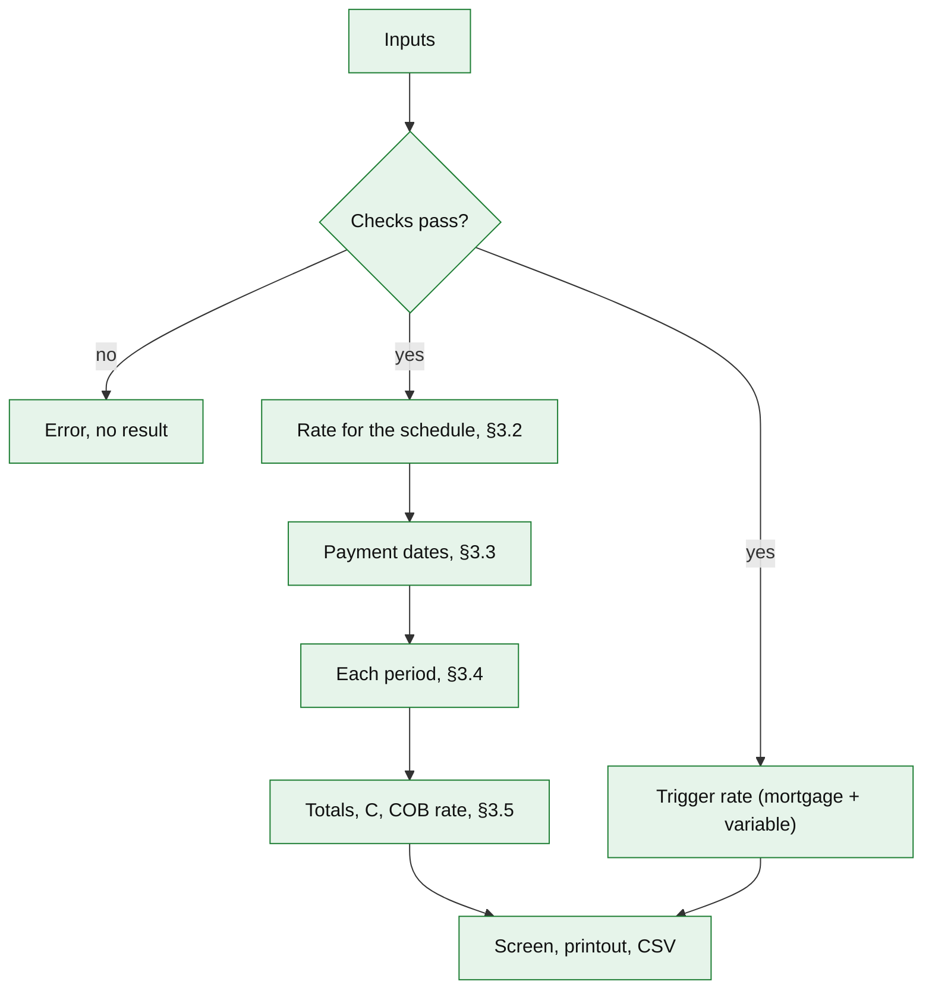

The checks (source `validate.ts`, `fees.ts`):

| Check | Source |
|---|---|
| Loan amount > 0 | BRD §6 |
| Contract rate > 0 (0% refused) | OQ-AA revised, DEV-OQAA |
| Payment amount > 0 ($0 refused) | OQ-Y revised, DEV-OQY |
| Each fee amount ≥ 0; all fees together < Loan amount | BRD §6, OQ-M |
| Start date on or before the First payment date; End date after it | BRD §6 |
| Accrued interest (Renewal, Payment change, VRPC) entered, ≥ 0 ($0 valid) | IN-11, decision 4 |
| Personal loan: Monthly only; VRPC: mortgage + variable only | FB-24; `flows.ts` |
| With fees, the start date cannot equal the only payment date (0-day term) | B13 |

The Contract term is not an input: it is a result, from the First payment date to the last scheduled payment date, shown on screen and in the printout (decision 8, DEV-OQP).

### 3.2 Which rate the schedule uses

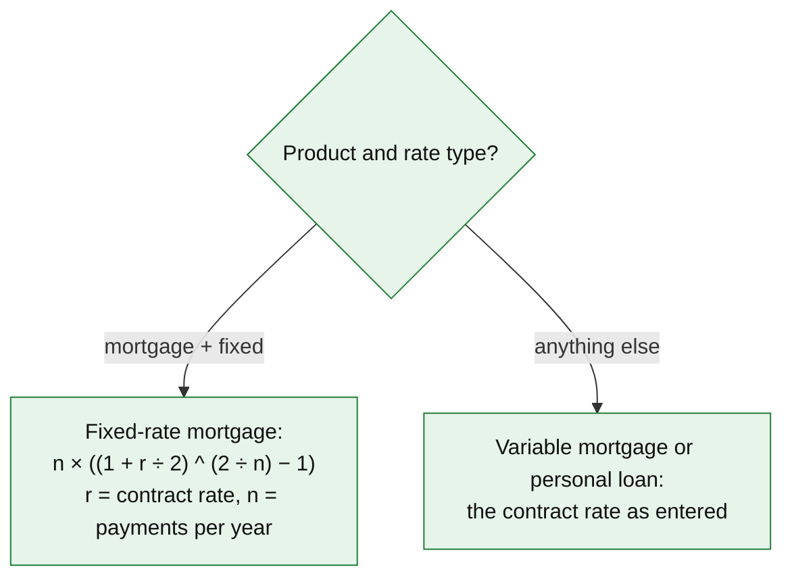

n: Weekly 52, Bi-weekly 26, Semi-monthly 24, Monthly 12. The two accelerated frequencies are hidden in the page (B28); the engine still accepts them with n 52 and 26. Sources: BRD §4.2, BR-01, BR-02, OQ-C. Check: the workbook's saved case REF-01 (fixed 3.74%, Accelerated Weekly) gives 3.706781471105014%, identical to Excel.

### 3.3 Payment dates

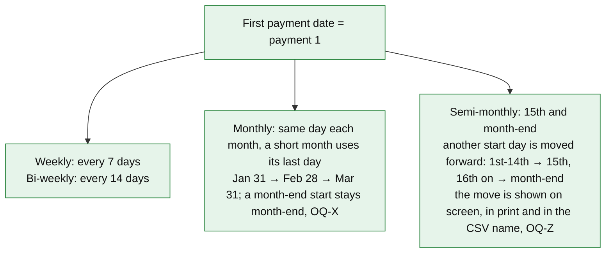

Sources: OQ-I, OQ-X, OQ-Z (decision 10, DEV-OQZ); `calendar.ts`. The note reads, for example, "First payment moved to Jan 15, 2027 (semi-monthly payments fall on the 15th and month-end)"; the Payment change flows say "Next payment moved to ...". The typed date stays in the field. Semi-monthly month-end means the real last day (Feb 28 is month-end in 2027, not in 2028). No payment is moved for weekends or holidays.

### 3.4 Each period

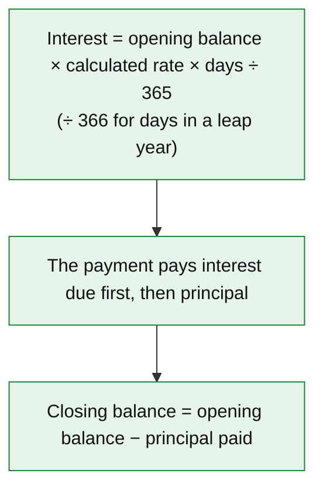

Sources: BR-11, BR-13; `equations.ts`, `cobCanada.ts`. Check: REF-01 row 1, $227,829.65 for the 6 days 2026-03-17 to 2026-03-23 gives interest $138.82433838712447 and principal $326.63566161287554, identical to Excel.

**Unpaid interest**

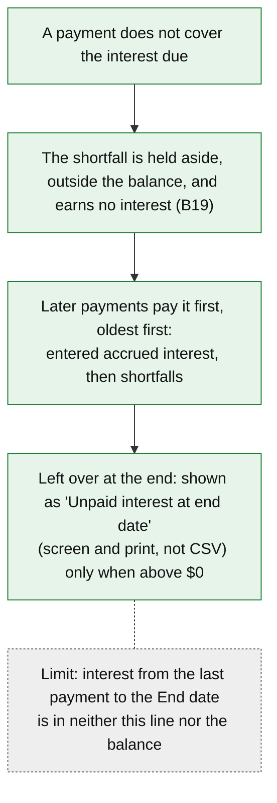

Source: decision 1 (DEV-OQL); `cobCanada.ts`. Balance columns never include unpaid interest.

**When the schedule stops**

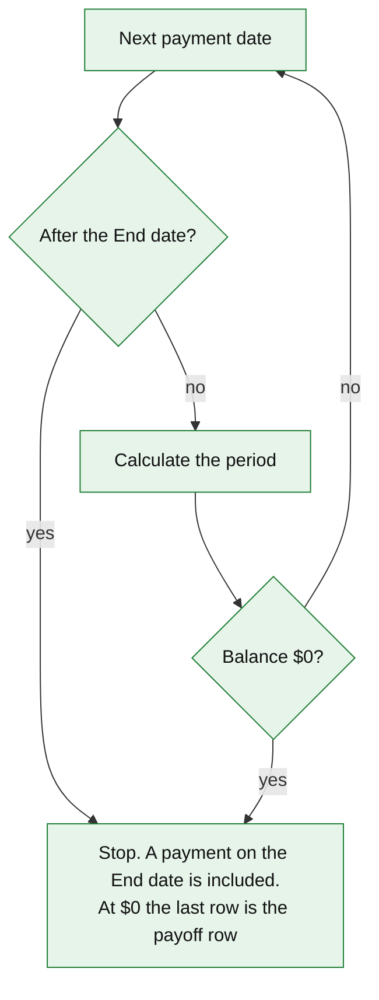

Sources: OQ-K, OQ-T. Check: first payment 2026-03-23, weekly, End date 2029-03-17 gives 156 payments, the last on 2029-03-12, as in Excel. **Payoff row (OQ-T, as in Excel):** its Payment column shows the principal only, with that row's interest in its own column, so "Total of all payments" is below the cash paid by that row's interest.

### 3.5 The COB rate

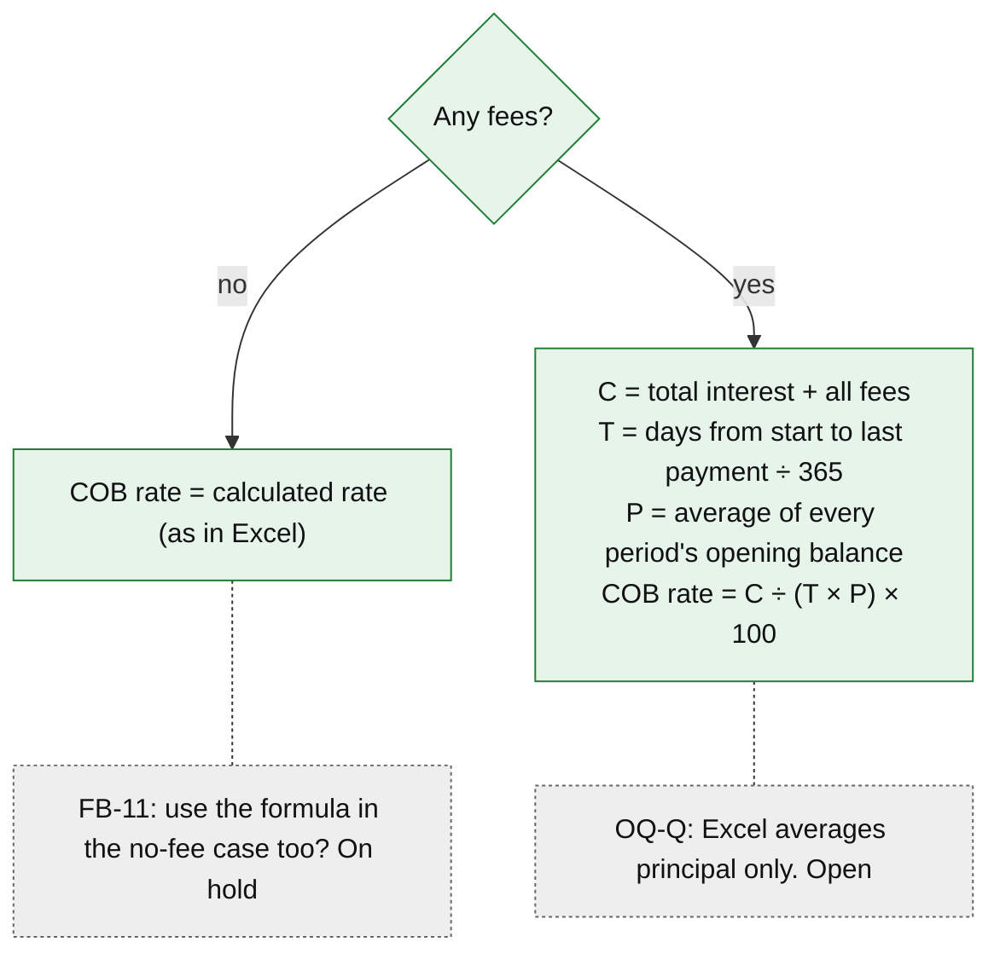

Sources: BRD §4.1, B.7; OQ-E, OQ-Q; decision 3. "Total interest" counts all period interest charged, paid or not. Accrued interest entered for a Renewal or Payment change counts in C only as far as payments repay it (OQ-W2, parked). Because unpaid interest is outside the balance, P is smaller, so the COB rate can rise even when C falls. Check: REF-01 has no fees, so its COB rate equals the calculated rate, identical to Excel.

### 3.6 Fees

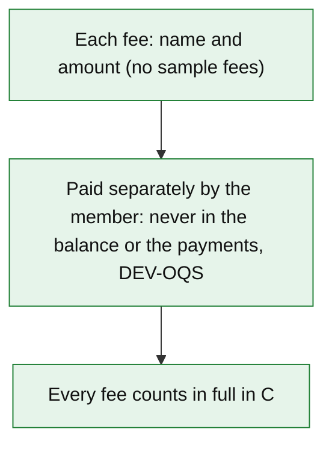

The page has no "Financed" choice (a switch keeps it in the engine). A fee staff once entered as financed is now a cash fee, so the COB rate can differ (example: REF-01 with one 500 fee, 3.7854% to 3.8266%). Sources: BRD IN-06, IN-07, BR-03, BR-04; OQ-S; decisions 6 and 7; B23.

---

## 4. Where we differ from the Excel workbook

Everything else matches Excel: REF-01 matches on 2,193 values.

| Topic | Workbook | This calculator | Decision | Status |
|---|---|---|---|---|
| Monthly dates from a month-end start | Apr 30 → May 30 | Apr 30 → May 31 | OQ-X, DEV-OQX | Today |
| Semi-monthly start not on the 15th or month-end | Keeps the entered pattern (10th / 25th) | Moved forward to the 15th or month-end, and shown | Decision 10, OQ-Z, DEV-OQZ | Today |
| Non-financed fees | Recovered through payments; lower P | Paid separately; counted in C only | OQ-S, DEV-OQS | Today |
| $0 payment | Accepted | Refused (must be > 0) | OQ-Y revised, DEV-OQY | Today |
| 0% contract rate | Accepted | Refused (must be > 0) | OQ-AA revised, DEV-OQAA | Today |
| Unpaid interest | Added to the balance; earns interest | Held aside; earns none; paid first, oldest first; all charged interest counts in C | Decision 1, DEV-OQL | Today (a switch can restore the workbook rule) |
| Accrued interest input | Does not exist | Required for Renewal, Payment change, VRPC ($0 allowed); outside the balance; earns no interest | OQ-W interim, DEV-W; decision 4 | Today; OQ-W2 parked |
| Contract term | An input | Read-only result; End date required | Decision 8, OQ-P, DEV-OQP | Today |
| Personal-loan frequency | Any | Monthly only | FB-24, DEV-FB24 | Today |
| Use cases | Do not exist | Three on screen (VRPC hidden), own start dates and labels; Renewal takes Mortgage or Personal loan | BRD IN-01, OQ-A; CHANGES §59 | Today (no workbook equivalent) |
| Financed option; accelerated frequencies; contract rate entry | Offered; offered; typed on a second sheet | Not offered; hidden; one contract-rate field | Decision 7; B28; OQ-N | Today (same results, no DEV ID) |
| P in the COB rate | Average opening principal | Average opening balance (BRD wording) | OQ-Q, candidate DEV-OQQ | Today; **open** |
| "Total principal paid" | Total payments − total interest | Sum of principal paid (BRD wording) | OQ-R, candidate DEV-OQR | Today; **open** |

Sources: `COB-architecture.md` §2.1 (register of deviations); `COB-user-stories.md` §7.3, §7.5; `reference/workbook-macro-source.txt`.

---

## 5. What to check

1. **Scope.** Is a printout the record kept on file (the CSV holds the schedule only; export format OQ-J is open)? Is the payment always worked out elsewhere and typed in? Should an invalid input show no result, or a result with a warning?
2. **Use cases.** Renewal accepts Mortgage and Personal loan (Monthly only); is that right? Should VRPC come back to the Flow list? Will staff know the arrears figure for Payment change, or is $0 too easy to type? The disclosed rate for the same loan moves about −0.09 points in the FB-16 example because the term starts earlier; acceptable?
3. **Rate and dates.** Variable mortgages are never converted. Monthly from Apr 30 goes May 31, Jun 30. Semi-monthly start days are moved (10th to 15th, 20th to month-end). No weekend or holiday shifting. Personal loans Monthly only. Accelerated options hidden. Is each right for your contracts?
4. **Period.** Interest then principal, for every product; leap-year days over 366; a shortfall earns no interest. Does this match how arrears work in the banking system?
5. **Ending.** Is a balance still owing at the End date expected? Is the workbook's payoff-row display acceptable on a disclosure? Is the line "Unpaid interest at end date" (hint: "Unpaid after the last payment; interest since then is not included") clear, given the interest since the last payment is not in it?
6. **COB rate.** With no fees the rate is the calculated rate even if C includes accrued interest paid (QA F-2; FB-11 on hold). Should P include financed fees (OQ-Q) and should entered accrued interest count in C (FB-25 W2, parked)?
7. **Fees.** Every fee is added to C and staff must leave excluded fees out (such as mortgage default insurance, FB-15, FB-28). Is that clear enough without a prompt? Should non-financed fees ever be recovered through payments (FB-9a / FB-18, parked)?
8. **Differences.** Is each difference in §4 one you want on the disclosure? The two marked open (P and "Total principal paid") need a business answer.

### Open and parked

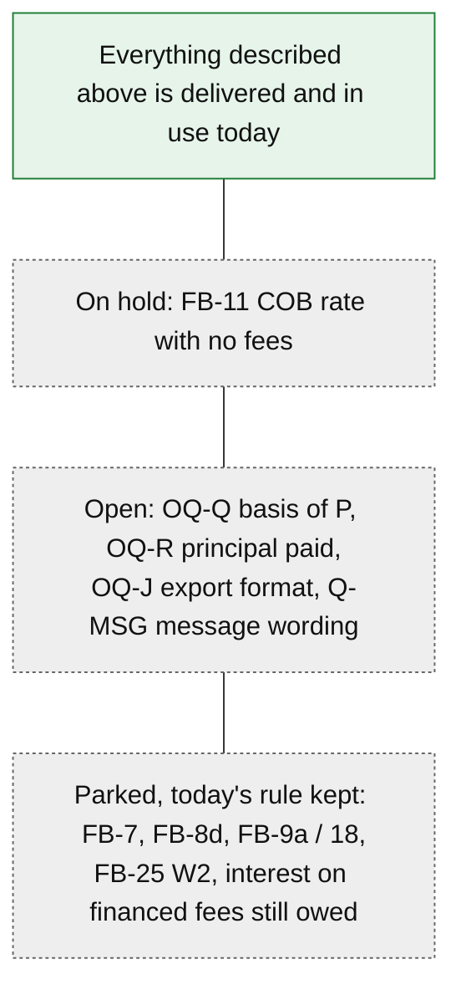

---

## Facts not verified for this overview

- Who uses the CSV, and whether a printout alone meets the record-keeping need (OQ-J), is not recorded.
- The FB-16 example is QA's measured figure from `COB-feedback-impact.md`; it was not re-run for this page.
