# COB Calculator: domain overview for review

**Audience:** lending and Credit Ops staff reviewing how the new Cost of Borrowing (COB) calculator works. It is not a developer document.
**Prepared:** 2026-09-29 by the architect; §5, §6 and §7 and the fee terms updated 2026-09-30 by the doc-writer after B23 was delivered, with B26 to B28 shown as planned; updated again 2026-09-30 after B28 and B27 were delivered; and after B26 was delivered (CHANGES §55); and again 2026-09-30 after B24 was delivered (CHANGES §56: derived Contract term, Contract date and semi-annual date hidden; B25 stays planned and B26-HINT, a hint reword, is in progress); §4.2 and the B19 rows updated 2026-09-29 by the doc-writer after B19 and B20 were delivered, from the live calculator (`COB-ts/`), the requirements (BRD v2.3), the recorded decisions (`COB-user-stories.md` §7, `COB-feedback-impact.md`) and the plan (`COB-architecture.md` revision 18).

## How to read this

Each section has one or more diagrams, then a short list headed **What to check**, which gives the questions we'd like you to confirm or challenge. Every box in a diagram is coloured to show whether it describes **today's** calculator or a **planned** change that's been decided but not yet built. The planned changes carry a work-item number (B24 to B28; B19 to B23 are delivered). A small reference such as `BR-13` or `OQ-X` points to the requirement or decision the rule comes from; you don't need to look these up to review the diagram. A red box marks a **known wrong result** in today's calculator that a planned change fixes. Grey boxes are **open**: nobody has decided them yet, so the diagram shows today's rule and says what's still to be decided. Unless a box says otherwise, amounts are calculated at full precision and rounded only for display (2 decimals for dollars).

### Legend

```mermaid
flowchart LR
    T["Today: how the calculator works now"]:::today
    P["Planned: decided, not yet built (B-item)"]:::planned
    W["Known wrong result today"]:::wrong
    O["Open or on hold: not decided"]:::open
    X["Out of scope: not part of this calculator (BRD)"]:::out
    T --- P
    P -.- W
    W --- O
    O --- X
    classDef today fill:#e6f4ea,stroke:#1e7e34,color:#111
    classDef planned fill:#fff4e5,stroke:#d97706,stroke-dasharray:5 5,color:#111
    classDef wrong fill:#fde8e8,stroke:#c0392b,stroke-width:2px,color:#111
    classDef open fill:#eeeeee,stroke:#666,stroke-dasharray:2 2,color:#111
    classDef out fill:#ffffff,stroke:#999,stroke-dasharray:4 4,color:#555
```

Dashed arrows (`-.->`) show a planned path; solid arrows show today's path. White dashed boxes are out of scope for this calculator, per the BRD.

### Glossary

| Term | Meaning in this calculator |
|---|---|
| **Use case** | What the calculation is for: New mortgage or loan, Renewal, Payment Change, or Variable Rate Payment Change (VRPC). The screen calls it "Flow". |
| **Contract rate** | The annual interest rate on the contract, as entered. |
| **Calculated rate** | The rate the schedule uses. For a fixed-rate mortgage it's the contract rate converted from semi-annual compounding to the payment frequency; for everything else it's the contract rate as entered. |
| **Start date** | The date interest starts: the Disbursal date (New), the Renewal date (Renewal), or the Payment Change / Last Payment date (Payment Change, VRPC; see §2). |
| **Period** | The days between one payment date and the next (the first period runs from the start date to the First Payment Date). |
| **Waterfall** | The order in which each payment is applied: interest first, then fees still owed, then principal (BR-13). |
| **Unpaid interest** | Interest a payment didn't cover. Since B19 it's held aside, outside the balance, and earns no interest. (The workbook adds it to the balance and charges interest on it; that rule stays in the code behind a switch that ships off.) |
| **Accrued interest** (input) | For Renewal, Payment Change and VRPC only: interest already owed when the calculation starts (IN-11). It's paid first and never earns interest. |
| **Financed fee** | A fee added to the loan and repaid through the payments. The calculation still supports it, but the page no longer offers it (since B23, the Financed option is switched off). |
| **Non-financed fee** | A fee the member pays separately. It never touches the balance or the payments; it only counts in C. Since B23 every fee entered on the page is treated this way. |
| **C (cost of borrowing amount)** | Total interest plus all fees over the term (§4.1, OQ-E). |
| **T (term in years)** | Days from the start date to the last payment date in the schedule, divided by 365. |
| **P (average balance)** | The simple average of the opening balance of every period in the schedule. The opening balance would include financed fees still owed, but the page sends none since B23. Since B19 it no longer includes unpaid interest. |
| **COB rate (APR)** | With fees: C ÷ (T × P) × 100. With no fees: the calculated rate (as in the workbook; FB-11 on hold). |
| **Trigger rate** | Mortgage + variable rate only: payment × payments per year ÷ Loan amount × 100. The rate above which the payment no longer covers the interest. |
| **The workbook** | The current Excel calculator, `Cost of Borrowing Rate Calc_Current.xlsm`, which this replaces. |

---

## 1. Scope and context

### 1.1 What the calculator does and doesn't do

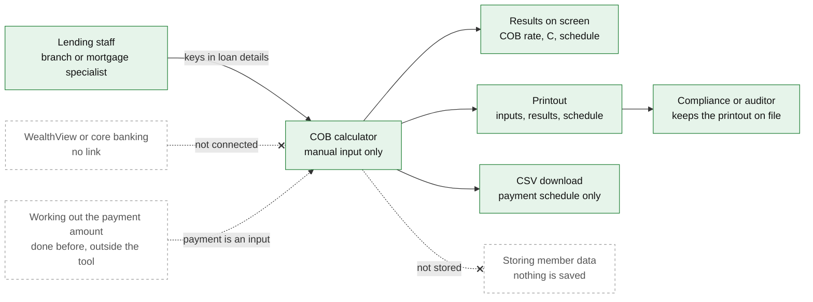

Sources: BRD §1.2, §2, §7; `COB-user-stories.md` §1 to §2; UI `ui/ca.js` (print and CSV download), `ui/ca-view.js` (CSV columns). White dashed boxes are outside the calculator.

**What to check**
- Is it right that the payment amount is always worked out elsewhere and typed in, and that the calculator never solves for it?
- Is a printout the record you keep on file? The digital export format is still open (OQ-J); today the CSV holds the payment schedule only, not the inputs or results.
- Is anyone other than lending staff expected to enter calculations?

### 1.2 One calculation, start to finish

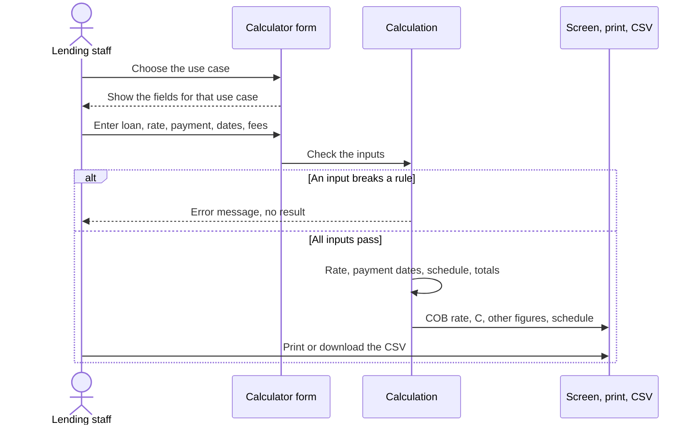

Sources: `COB-user-stories.md` UC-01 to UC-08; `COB-ts/src/ca/cobCanada.ts` (checks run before any calculation). Today's behaviour; the error messages still use internal field names (open item Q-MSG).

**What to check**
- Should the calculator refuse to show any result while an input is wrong (today's behaviour), or show the result with a warning?

---

## 2. The four use cases

### 2.1 What each use case asks for and locks

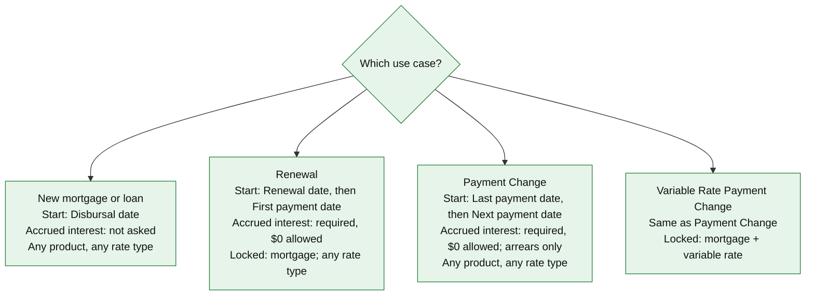

Every use case also asks for: product type, rate type, contract rate, Loan amount, payment amount, payment frequency, First payment date (called Next payment date for Payment Change and VRPC), End date, and fees. For Renewal, Payment Change and VRPC, the Loan amount means the balance on the start date (IN-02, FB-22).

Sources: `COB-ts/src/ca/flows.ts` (start field, accrued-interest handling, locks); `validate.ts` (VRPC lock); stakeholder decisions 2, 4, 5 and 9 (`COB-feedback-impact.md`, top table); B20 (delivered, `CHANGES.md` §49), B21 (delivered, `CHANGES.md` §50), B22 (delivered, `CHANGES.md` §51). Since B20 the Accrued interest box opens blank for Renewal, Payment Change and VRPC, and a blank is refused with the message "flow '`<flow>`' requires accruedInterest (enter 0 if there is none)" (interim wording, Q-MSG open); $0 is accepted.

Since B22 the screen, the Contract-terms tiles and the printout use the same labels for each use case: New "Disbursal date", Renewal "Renewal date" / "First payment date", Payment Change and VRPC "Last payment date" / "Next payment date" (doc finding F1, resolved). "Last payment date" means the last payment of any size. The field name "Accrued interest" is unchanged in every use case.

**What to check**
- Renewal is mortgage-only (decision 9; delivered, B21). Payment Change stays open to personal loans. Is that right?
- VRPC is always mortgage + variable rate. Is there any VRPC case for another product?
- For New loans, is there ever accrued interest to enter? (Today the field is hidden.)
- Accrued interest is now required for the other three use cases (decision 4). Will staff always know the figure, or is $0 too easy a default to type?

### 2.2 Payment Change and VRPC: which dates, and what "Accrued interest" holds

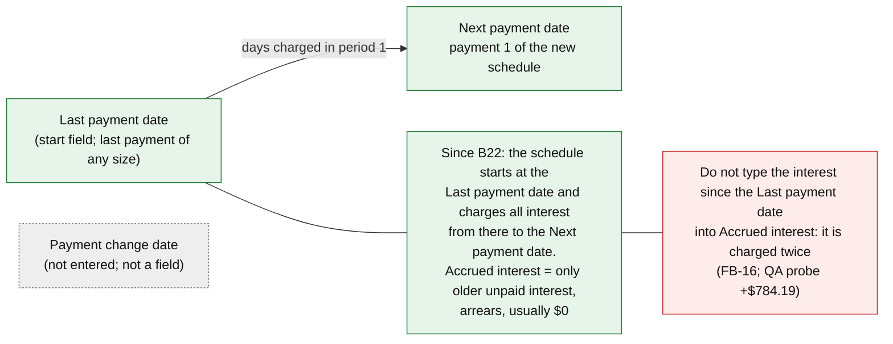

Sources: stakeholder decision 2 (FB-16); QA's worked example in FB-16; B22 (delivered, `CHANGES.md` §51). The calculation itself didn't change: it charges interest from whatever start date is entered. B22 changed the labels, so staff enter the Last payment date, and added the arrears hint (interim wording, Q-MSG): "Only interest due at earlier payments and not yet paid (arrears), usually $0.00. Interest since the last payment date is already charged." With the name "Accrued interest" unchanged, the hint and the user manual are the only guard against the double count.

Worked example (FB-16, QA): variable mortgage, $250,000 balance at 5.19%, monthly $1,500, one $250 fee, last payment 2027-01-01, change date 2027-01-20, next payment 2027-02-01.
- The old way (start 2027-01-20, accrued $675.41 for the 19 days): C $37,970.45, COB rate 5.3115%.
- The way since B22 (start = Last payment date 2027-01-01, accrued $0 arrears): C $37,970.45, the same, but COB rate 5.2194%, because the term is 19 days longer.
- Wrong combination to avoid (start 2027-01-01 **and** accrued $675.41): C $38,754.64, because the 19 days are counted twice.

**What to check**
- Staff enter the Last payment date and put only **arrears** in Accrued interest. Will staff know the arrears figure, and is it usually $0?
- The disclosed rate for the same loan moves a little (about −0.09 points in the example) because the term is measured from an earlier date. Is that acceptable?
- Does VRPC use exactly the same dates as Payment Change?

---

## 3. The calculation pipeline

### 3.1 End to end

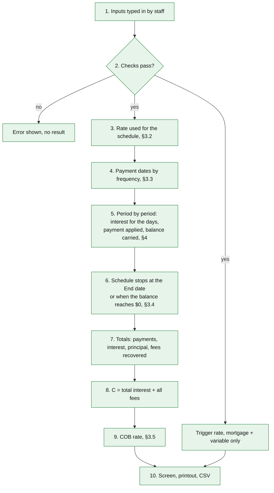

Sources: `COB-ts/src/ca/cobCanada.ts` (`calculateCobCanada`, the order of steps); BRD Appendix B.

The checks in step 2, today (`validate.ts`, `fees.ts`):

| Check | Source |
|---|---|
| Loan amount > 0 | §6 |
| Contract rate > 0 (0% is refused) | OQ-AA revised, DEV-OQAA |
| Payment amount > 0 ($0 is refused) | OQ-Y revised, DEV-OQY |
| Each fee amount ≥ 0; financed + non-financed fees together < Loan amount | §6, OQ-M |
| Start date on or before the First payment date; End date after the First payment date | §6 |
| Accrued interest (Renewal, Payment Change, VRPC): must be entered, ≥ 0; $0 is valid | IN-11, BR-05, decision 4 (B20) |
| VRPC is mortgage + variable rate | `flows.ts` |
| Contract term | Since B24 (delivered): not an input, so not checked. It is a read-only result from the first payment date to the last scheduled payment date. A term under one month is allowed. The old checks (whole years, months 0 to 11, not both 0) are gone |
| Semi-annual compounding date (fixed mortgage) | Since B24 (delivered): hidden and not required (engine switch `SEMI_ANNUAL_DATE_REQUIRED`, off); a date that is present but invalid is still rejected |
| With fees, the start date can't be the same day as the only payment (a 0-day term) | B13 |

The contract term and the semi-annual compounding date never affected any figure. That's why decision 8 hid the date and derived the term (B24, delivered).

**What to check**
- Is each check above a real business rule? Are any missing (for example a maximum term or a minimum payment)?
- Is there a case where fees can equal or exceed the Loan amount?

### 3.2 Which rate the schedule uses

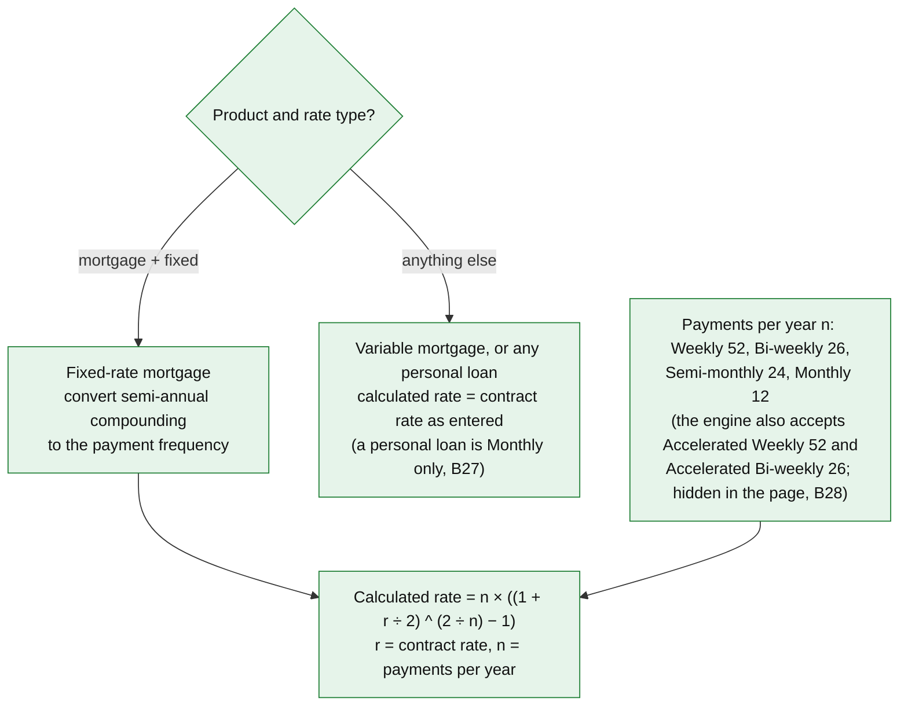

Sources: BRD §4.2, BR-01, BR-02; OQ-C (workbook cell Calculator!D10); `COB-ts/src/ca/equations.ts` (`calculatedRateFor`); `types.ts` (payments per year). Check: REF-01, the workbook's saved case, fixed mortgage 3.74% Accelerated Weekly → calculated rate 3.706781471105014%, identical to Excel.

**What to check**
- Personal loans use the contract rate unchanged. **Today (B27, delivered 2026-09-30):** a personal loan may only have Monthly payments, in every use case; the engine rejects other frequencies and the page locks the frequency to Monthly (FB-24 decision; deviation DEV-FB24; the workbook accepted any frequency). Is that right?
- **Today (B28, delivered 2026-09-30):** Accelerated Weekly and Accelerated Bi-weekly are hidden from the frequency list in the page (the calculation still accepts them and gives the same result as Weekly / Bi-weekly). The list shows Weekly, Bi-weekly, Semi-monthly and Monthly. Is that acceptable?
- Variable mortgages are never converted. Is that right?

### 3.3 Payment dates by frequency

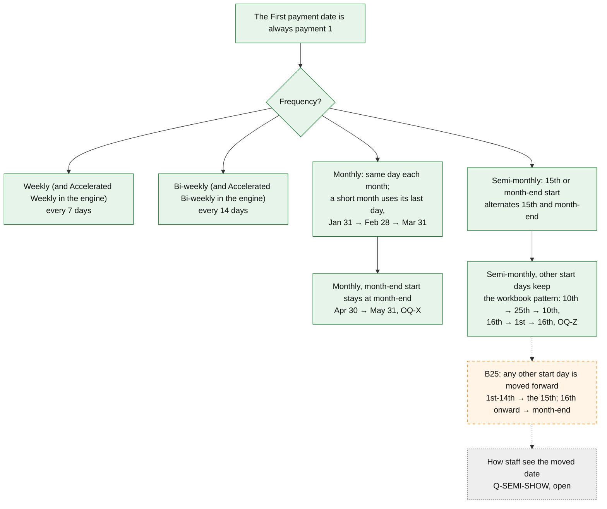

Sources: OQ-I (First payment date = payment 1); `COB-ts/src/ca/calendar.ts` (`addMonthsClamped`, `nextSemiMonthlyDate`, `periodDateFor`); OQ-X and OQ-Z decisions (`COB-user-stories.md` §7.3, §7.5); stakeholder decision 10 and plan B25. Accelerated frequencies use the same dates and the same n as the regular ones (BR-09, B8). Monthly without a month-end start keeps the day number where it can: Jan 30 → Feb 28 → Mar 30. Semi-monthly month-end means the real last day: Feb 28 is month-end in 2027 but not in 2028.

**What to check**
- Monthly: a payment that starts on Apr 30 continues May 31, Jun 30. Is that what the member's contract says?
- Semi-monthly after B25: a First payment date of the 10th becomes the 15th, and a 20th becomes the month-end. Should staff be told the date moved (Q-SEMI-SHOW)?
- No payment is ever moved for weekends or holidays. Is that right?

### 3.4 When the schedule stops, and the last payment

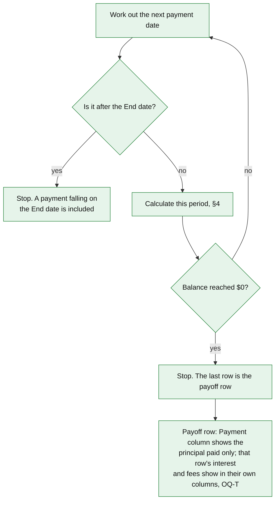

Sources: OQ-K, OQ-T (decision 2026-09-27: keep the workbook's payoff row); `cobCanada.ts` (`buildSchedule`); `equations.ts` (`applyPaymentWaterfall`). Check: REF-01, first payment 2026-03-23, weekly, End date 2029-03-17 → 156 payments, the last on 2029-03-12, as in Excel.

Because of the payoff-row rule, "Total of all payments" is lower than the cash the member actually pays by that row's interest and fees. This follows the workbook on purpose.

**What to check**
- Is a balance still owing at the End date expected (a renewal term shorter than the amortization)? The result shows it as "Balance at end date".
- Is the workbook's payoff-row display acceptable on a disclosure, or should the payoff row show the full cash paid?

### 3.5 The COB rate

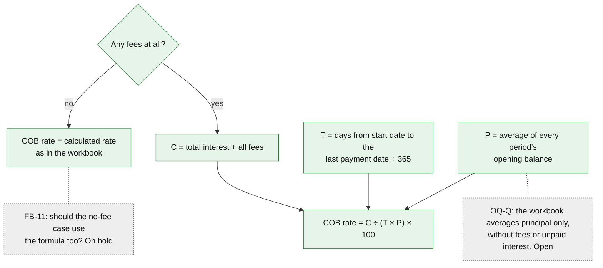

Sources: BRD §4.1, B.7; OQ-E, OQ-Q; workbook macro lines 563 to 569; `equations.ts` (`costOfBorrowingRatePercent`, `cobRatePercent`); `cobCanada.ts` (`averageOutstandingBalance`, term days); stakeholder decision 3 (FB-11 on hold). Check: REF-01 has no fees, so its COB rate 3.706781471105014% is the calculated rate, identical to Excel.

"Total interest" in C, today (since B19): all period interest charged, including period interest still unpaid at the end (no exception any more). Accrued interest entered for a Renewal or Payment Change counts in C only as far as the payments repay it (OQ-W2; parked, decision 11).

Since B19, P is smaller because unpaid interest no longer sits in the balance, so the COB rate can rise even when C falls (a QA trial figure from the plan: C $30,043.95 → $28,632.83, rate 5.6391% → 5.6645%; not re-run for this document, and not confirmed as the delivered result).

**What to check**
- With fees, P includes financed fees still owed (today). The workbook excludes them (OQ-Q, open). Which does the regulation intend?
- With no fees, a Renewal with accrued interest shows the calculated rate even though C includes the accrued interest paid (QA finding F-2). Is that acceptable while FB-11 is on hold?
- Should accrued interest entered for a Renewal or Payment Change count in C at all (FB-25 W2, parked)?

---

## 4. One payment period in detail

### 4.1 The waterfall, today

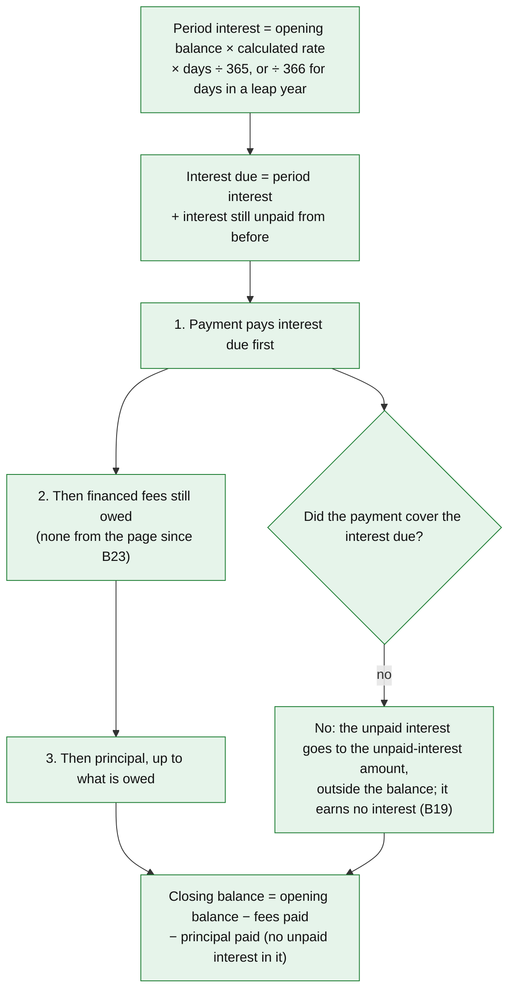

Sources: BR-11, BR-13, BRD B.3 and B.5; OQ-L as revised by decision 1 (DEV-OQL, B19); `equations.ts` (`periodInterest`, `applyPaymentWaterfall`); `calendar.ts` (`dayCountFraction`); `cobCanada.ts` (`buildSchedule`). Check: REF-01 row 1, $227,829.65 at 3.706781…% for the 6 days 2026-03-17 to 2026-03-23 → interest $138.82433838712447, principal $326.63566161287554, identical to Excel.

The opening balance starts at the Loan amount, which already includes financed fees, so interest is charged on financed fees until they're repaid (workbook behaviour). Non-financed fees never enter the balance or the waterfall (§5).

**What to check**
- Is interest-then-fees-then-principal the right order for every product?
- Days in a leap year are divided by 366, other days by 365. Is that the day count in the loan contracts?

### 4.2 Unpaid interest: today (B19 and B26)

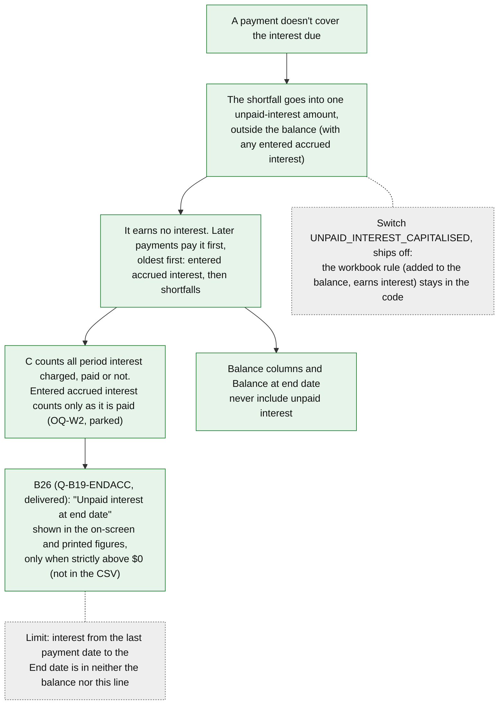

Sources: stakeholder decision 1 (FB-14, FB-29, FB-25) and the follow-up Q-W4-INT (oldest first); deviation DEV-OQL; `CHANGES.md` §48 (B19, QA PASS WITH NOTES); `cobCanada.ts` (`buildSchedule`, rules B19-R1 to R5), `policies.ts` (`UNPAID_INTEREST_CAPITALISED = false`, ADR-14); tests `b19-unpaid-interest.test.ts` and `golden/b19-switch-on.test.ts` (switch on reproduces the old goldens byte for byte). Q-B19-ENDACC: the user's answer "yes", delivered as B26 (`CHANGES.md` §55, QA PASS WITH NOTES): the figure "Unpaid interest at end date" (hint "Owed in addition to the balance at end date", interim wording under Q-MSG) follows "Balance at end date" on screen and in print when the last schedule row's unpaid interest is strictly above $0. REF-01 and loans that end fully paid show no line. The amount also stays in the last row's Accrued interest (closing) column. **Limit (QA):** interest accruing between the last payment date and the End date is in neither figure (example: last payment 2028-04-01, End date 2028-04-15, about 14 days, roughly $380 on $200,000), so the two figures together are not the complete amount owed on the End date.

The FB-25 wrong result (C understated when accrued interest was entered and period interest was left unpaid at the End Date) is fixed by B19: period interest charged now counts in C whether or not it was paid (`CHANGES.md` §48; FB-25 is a listed reason for B19). QA's earlier example ($100,000 Renewal at 6%, monthly $400, 24 months: total interest $12,142.16 with accrued interest $0, $9,600.00 with $850.25) described the old behaviour; it wasn't re-run for this document.

**What to check**
- A member whose payment doesn't cover the interest is never charged interest on that shortfall. Does this match how the banking system treats arrears?
- "Oldest first": the entered accrued interest is paid before any later shortfall. Confirm.
- One amount now holds two kinds of interest with two rules for C: period shortfalls count as charged, entered accrued interest counts only when paid (OQ-W2, parked). Is that intended?
- Financed fees still owed would stay in the interest base (FB-29's "interest only on principal" would change that; parked). Since B23 switched Financed off, the page sends no financed fee, so this only matters if the option is switched back on. Is that acceptable?
- The figure "Unpaid interest at end date" is delivered (B26). The hint today reads "Owed in addition to the balance at end date", which could be read as the full amount owed, because interest from the last payment date to the End date is not included. The user decided on 2026-09-30 to reword it to "Unpaid after the last payment; interest since then is not included" (change in progress: B26-HINT, not built yet). Is the new wording clear to you?

---

## 5. Fees

### 5.1 How fees are entered and counted (today, since B23)

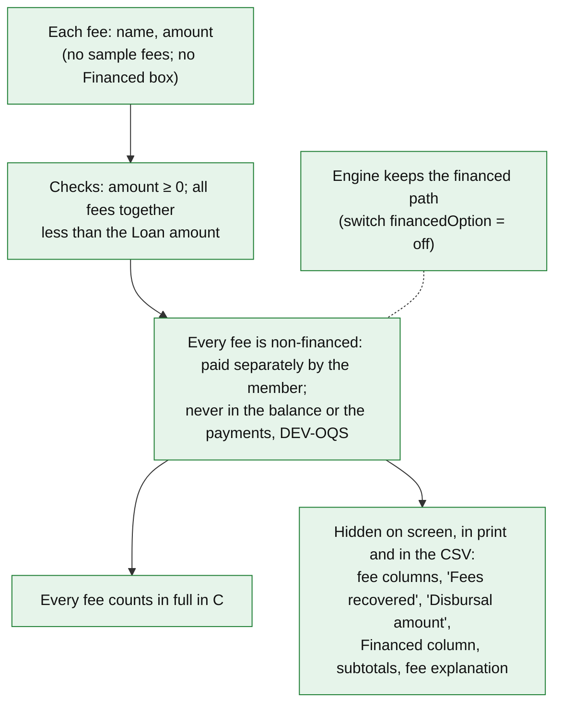

Sources: BRD IN-06, IN-07, BR-03, BR-04, §6; OQ-D, OQ-E, OQ-M, OQ-S decisions; B10 (every fee counts); stakeholder decisions 6 and 7 and Q-FEE-CSV; B23 (delivered 2026-09-30, `CHANGES.md` §52, QA PASS WITH NOTES); `COB-ts/src/ca/fees.ts`, `cobCanada.ts`; `ui/ca-view.js` (`UI_SWITCHES.financedOption = false`). A blank fee amount is read as a $0 fee (open item Q-A10-1).

### 5.2 What changed for staff with B23

- The form opens with no sample fees. Fee table headers are Name / Amount ($) / Actions. The printout with no fees says "No fees."
- **A fee staff used to enter as financed is now a cash fee.** It is no longer taken as already inside the Loan amount, so the COB rate can differ. Example (QA): the REF-01 loan with one 500 fee goes from 3.7854% to 3.8266%.
- The financed calculation is kept in the engine behind a switch and is tested in both states; the on-branch of the page itself has no automated page check.

**What to check (§5.1 and §5.2)**
- Financed is off: every fee is treated as paid separately, so it adds to C but not to the payments or the balance. Is there any fee staff still add to the loan? If so, the COB rate will differ from before.
- Which fees go into C? The stakeholders said all of them (FB-28), and the old sample "CMHC mortgage default insurance" fee is the kind the law excludes, which is why the sample fees were removed (FB-15). Staff must leave excluded fees out. Is that clear enough without a prompt on screen?
- Non-financed fees: should they ever be recovered through the payments, as the workbook does (FB-9a / FB-18, parked)?

---

## 6. Where we differ from the Excel workbook, and why

| Topic | Workbook | This calculator | Decision | Status |
|---|---|---|---|---|
| Monthly dates from a month-end start | Keeps the day number: Apr 30 → May 30 | Stays at month-end: Apr 30 → May 31 | OQ-X, DEV-OQX | Today |
| Non-financed fees | Taken out of principal, recovered through payments, and lower P | Paid separately; never in principal, payments or balance; counted in C only | OQ-S, DEV-OQS | Today (every fee from the page since B23) |
| $0 payment | Accepted; runs a schedule where nothing is paid | Refused: payment must be > 0 | OQ-Y revised, DEV-OQY | Today |
| 0% contract rate | Accepted | Refused: rate must be > 0 | OQ-AA revised, DEV-OQAA | Today |
| Accrued interest input (IN-11) | Doesn't exist | New input for Renewal / PC / VRPC, required ($0 allowed; B20), kept outside the balance, earns no interest | OQ-W interim, DEV-W; decision 4 (B20) | Today; OQ-W2 parked |
| Use cases | Don't exist (one "Disbursal date") | Four use cases with their own start dates and labels (Payment Change and VRPC: Last payment date / Next payment date) | BRD IN-01, OQ-A | **Today (B22)** |
| Contract rate entry | Semi-annual rate typed on a second sheet | One contract-rate field | OQ-N | Today |
| Accelerated frequencies | Separate options, same dates and n as regular | Same in the engine. The page hides the two options | B8; "Accelerated frequencies hidden" (2026-09-30) | **Today (B28)** (UI only; no DEV ID: same results) |
| Personal-loan payment frequency | Any frequency (no product type) | Monthly only, in every use case; the engine rejects others and the page locks the field | FB-24 decision, B27 answers, DEV-FB24 | **Today (B27)** (deviation DEV-FB24) |
| Financed option | Offered (financed-fee input) | Not offered; every fee non-financed | Decision 7, Q-B23-FIX | **Today (B23)**; not a deviation in outputs for the same inputs |
| P in the COB rate | Average opening principal | Average opening balance (BRD wording) | OQ-Q, candidate DEV-OQQ | Today; **open** |
| "Total principal paid" | Total payments − total interest (includes fees paid) | Sum of principal paid (BRD wording) | OQ-R, candidate DEV-OQR | Today; **open** |
| Unpaid interest | Added to the balance; earns interest | Held aside; earns no interest; paid first, oldest first; all period interest charged counts in C | Decision 1, DEV-OQL | Today (B19); the workbook rule stays behind a switch that ships off. Since B26 the amount left at the end is also shown as "Unpaid interest at end date" |
| Contract term | An input; ends the schedule when End date is blank | Read-only result worked out from the First payment date to the last scheduled payment date (years, months, leftover days; 2026-09-30 refinement; blank until a schedule exists; printed and in the tile, not in the CSV); End date required | Decision 8, OQ-P, DEV-OQP | **Today (B24, delivered 2026-09-30)** |
| Semi-monthly start not on the 15th or month-end | Keeps the entered pattern (10th / 25th) | Moved forward to the next 15th or month-end | Decision 10, revises OQ-Z, DEV-OQZ | **Planned B25** |
| Renewal for personal loans | No use cases | Renewal is mortgage-only | Decision 9 | **Today (B21)** (no workbook equivalent) |

Sources: `COB-architecture.md` §2.1 (register of intentional deviations); `COB-user-stories.md` §7.3, §7.5; `COB-feedback-impact.md` (top table); workbook macro (`reference/workbook-macro-source.txt`). Everything else is meant to match the workbook exactly: the saved workbook case REF-01 matches on 2,193 values.

**What to check**
- Is each difference one you want on the disclosure? The two marked "open" (P and "Total principal paid") need a business answer before they can be settled.

---

## 7. Status map

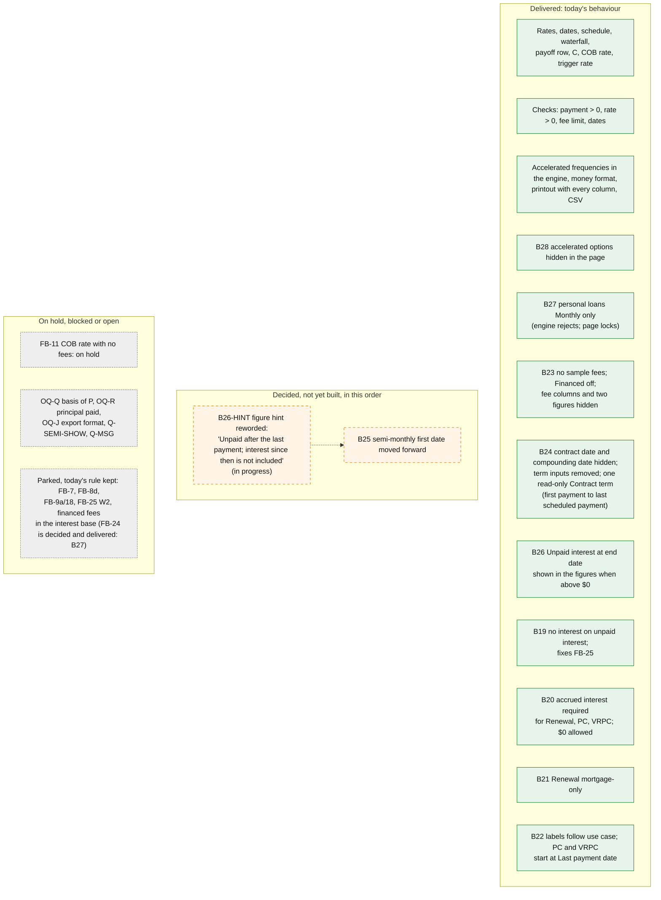

Sources: `HANDOFF.md` (delivered items, 2026-09-30); `COB-architecture.md` §5 (B19 to B28 and their order: B25 and B26-HINT remain; B19 to B24 and B26 to B28 are delivered); `COB-feedback-impact.md` (decisions 3 and 11, follow-ups); `COB-user-stories.md` §6 and §7.

Which diagrams show what:

| Section | Shows today | Shows planned |
|---|---|---|
| 1 Scope | all | none |
| 2 Use cases | locks incl. Renewal mortgage-only (B21), labels and start fields (B22), accrued interest required (B20) | none |
| 3 Pipeline | all steps, including B19's effect on P and the B24 checks | B25 (semi-monthly) |
| 4 Waterfall | §4.1; §4.2 (B19, B26) | none |
| 5 Fees | §5.1 and §5.2 (B23, delivered) | none |
| 6 Differences | rows marked Today | rows marked Planned |

**What to check**
- Is the order of the planned items right for you? B19 went first because it was the only one that changes figures on existing disclosures; B19 to B24 and B26 to B28 are delivered. B25 and the B26-HINT reword remain.
- FB-11 is on hold. Who will settle it, and by when?

---

## Facts not verified for this overview

- Who uses the CSV, and whether a printout alone satisfies the record-keeping need (OQ-J), is not recorded anywhere.
- The FB-16 dollar example is QA's measured figure quoted from `COB-feedback-impact.md`; it wasn't re-run for this document. The FB-25 example was re-run on 2026-09-29 against the built engine after B20: golden case `extra:minimumPayment`, renewal with accrued $850, weekly-to-semi-monthly case `first=2028-02-11 semiMonthly mortgage/variable fees=fin2000cash400`, gives C $28,708.98 at 5.66%, as QA said. (The old $2,400.49 was the fees only, before B19.)
- The B19 example (C $30,043.95 → $28,632.83) is QA's measurement on a trial version of the rule, quoted from `COB-architecture.md` §5 B19. B19 is now delivered (`CHANGES.md` §48), and this figure was not re-run against the delivered code.
