# Implement lending-skill gap use cases (PUC1-PUC6)

## Summary

`cob-calculator` originally covered 5 use cases (simple fixed-rate loans, home-price
loans, single-segment amortization, multi-segment mortgage lifecycles, and input
validation). A gap analysis against this project's `lending` skill (a reference
mortgage-analysis implementation) identified 6 categories of common lending
calculations the library couldn't do yet. This PR implements all 6, with tests and a
consolidated spec.

**Problem this solves:** the library could amortize a loan and stitch renewals
together, but couldn't answer the questions that actually drive a borrower's or
lender's decision — *should I pay points, is this refinance worth it, when does PMI
drop off, what's the balloon payment, what happens when my ARM resets, is this loan
DSCR-qualified* — without reaching for a separate tool. Those calculations now live in
the same engine, sharing its amortization core instead of re-deriving it.

## Before → after

```mermaid
flowchart TD
    root(["cob-calculator — proposed v2 use cases (gap analysis)"])

    root --> PUC1
    root --> PUC2
    root --> PUC3
    root --> PUC4
    root --> PUC5
    root --> PUC6

    PUC1["PUC1: Extra & lump-sum principal payments"]
    PUC1 --> PUC1a["Recurring extra monthly payment\nmirrors lending.extra_payment_savings()"]
    PUC1 --> PUC1b["One-time lump sum applied at a renewal"]
    PUC1 --> PUC1c["Biweekly payment schedule"]

    PUC2["PUC2: Recurring costs & PMI"]
    PUC2 --> PUC2a["Property tax / home insurance / HOA\nannual % increase support"]
    PUC2 --> PUC2b["PMI cost + auto-drop at 80% LTV"]
    PUC2 --> PUC2c["Cost breakdown output"]

    PUC3["PUC3: Qualification & risk ratios"]
    PUC3 --> PUC3a["Loan-to-Value (LTV)"]
    PUC3 --> PUC3b["Combined LTV for HELOC / second lien"]
    PUC3 --> PUC3c["DSCR for investment-property segments"]

    PUC4["PUC4: Alternative payment structures"]
    PUC4 --> PUC4a["Interest-only segment"]
    PUC4 --> PUC4b["Balloon payment reporting"]
    PUC4 --> PUC4c["ARM index+margin reset with rate caps"]

    PUC5["PUC5: Comparison & breakeven tooling"]
    PUC5 --> PUC5a["Mortgage points breakeven"]
    PUC5 --> PUC5b["Refinance breakeven & total-cost comparison"]
    PUC5 --> PUC5c["Side-by-side term comparison"]

    PUC6["PUC6: Statement reconciliation tooling"]
    PUC6 --> PUC6a["Override reason/audit trail"]
    PUC6 --> PUC6b["Bulk override import (CSV/JSON)"]

    classDef gap fill:#fff3cd,stroke:#d39e00,color:#664d03,stroke-dasharray: 4 3;
    class PUC1,PUC2,PUC3,PUC4,PUC5,PUC6,PUC1a,PUC1b,PUC1c,PUC2a,PUC2b,PUC2c,PUC3a,PUC3b,PUC3c,PUC4a,PUC4b,PUC4c,PUC5a,PUC5b,PUC5c,PUC6a,PUC6b gap;
```

*Full source: [`usecases-proposed.mmd`](./usecases-proposed.mmd) — the original gap
analysis this PR closes.*

```mermaid
flowchart TD
    root(["cob-calculator — after this PR"])

    root --> UC1["UC1-UC5: v1 baseline\n(simple loans, segments, renewals, validation)"]
    root --> UC6
    root --> UC7
    root --> UC8
    root --> UC9
    root --> UC10
    root --> UC11

    UC6["UC6: Extra & lump-sum principal payments"]
    UC6 --> UC6a["calculateExtraPaymentSavings()"]
    UC6 --> UC6b["MortgageInput.lumpSumPayments"]
    UC6 --> UC6c["calculateBiweeklySchedule()"]

    UC7["UC7: Recurring costs & PMI"]
    UC7 --> UC7a["applyRecurringCosts()"]
    UC7 --> UC7b["calculatePmiPayment() + 80% LTV auto-drop"]
    UC7 --> UC7c["LoanSummary.costBreakdown"]

    UC8["UC8: Qualification & risk ratios"]
    UC8 --> UC8a["loanToValue(), combinedLoanToValue()"]
    UC8 --> UC8b["debtServiceCoverageRatio()"]

    UC9["UC9: Alternative payment structures"]
    UC9 --> UC9a["Segment.interestOnly"]
    UC9 --> UC9b["Segment.balloon + LoanSummary.balloonPaymentDue"]
    UC9 --> UC9c["calculateArmResetRate()"]

    UC10["UC10: Comparison & breakeven tooling"]
    UC10 --> UC10a["calculatePointsBreakeven()"]
    UC10 --> UC10b["calculateRefinanceBreakeven(), compareRefinance()"]
    UC10 --> UC10c["compareLoanTerms()"]

    UC11["UC11: Statement reconciliation tooling"]
    UC11 --> UC11a["ManualPaymentOverride.reason"]
    UC11 --> UC11b["importOverridesFromJson(), importOverridesFromCsv()"]

    classDef done fill:#d4edda,stroke:#28a745,color:#14532d;
    class UC1,UC6,UC6a,UC6b,UC6c,UC7,UC7a,UC7b,UC7c,UC8,UC8a,UC8b,UC9,UC9a,UC9b,UC9c,UC10,UC10a,UC10b,UC10c,UC11,UC11a,UC11b done;
```

*Full source: [`usecases.mmd`](./usecases.mmd) — the current-state diagram (85/85
tests passing).*

## What's new

| Category | Adds |
|---|---|
| **Extra & lump-sum payments** | `calculateExtraPaymentSavings()`, `MortgageInput.lumpSumPayments` (applied at a renewal boundary), `calculateBiweeklySchedule()` |
| **Recurring costs & PMI** | `applyRecurringCosts()` (property tax/insurance/HOA with annual escalation), `calculatePmiPayment()` with 80%-LTV auto-drop, `LoanSummary.costBreakdown` |
| **Qualification ratios** | `loanToValue()`, `combinedLoanToValue()`, `debtServiceCoverageRatio()` |
| **Alternative payment structures** | `Segment.interestOnly`, `Segment.balloon` + `LoanSummary.balloonPaymentDue`, `calculateArmResetRate()` (index+margin with initial/periodic/lifetime caps) |
| **Comparison & breakeven tooling** | `calculatePointsBreakeven()`, `calculateRefinanceBreakeven()` / `compareRefinance()`, `compareLoanTerms()` |
| **Statement reconciliation** | `ManualPaymentOverride.reason` / `AmortizationEntry.overrideReason`, `importOverridesFromJson()` / `importOverridesFromCsv()` |

Full design rationale, worked examples, and known v1 scope cuts are in
[`docs/spec.md`](./spec.md).

## Design notes worth a reviewer's attention

- **No breaking changes.** Every new field (`Segment`, `MortgageInput`,
  `ManualPaymentOverride`, `AmortizationEntry`, `LoanSummary`) is optional and additive.
  Existing callers see no behavior change unless they opt into a new field.
- **Balloon payments required resolving a real conflict**: the original validation
  explicitly forbade `termMonths` on the last segment (it's what makes the loan run to
  payoff). Balloon semantics need the opposite — the last segment stops early with a
  nonzero balance. Resolved with an explicit opt-in `Segment.balloon` flag; absent, the
  original rule is byte-identical (verified: the pre-existing regression test for that
  rule still passes unmodified).
- **Cost breakdown is additive, not intrusive.** PMI/tax/insurance/HOA are computed in
  a separate post-processing pass (`applyRecurringCosts`) rather than woven into the
  core amortization loop, so `totalOfPayments`/`totalInterestPaid` stay P&I-only —
  verified with an explicit regression test comparing runs with and without costs
  configured.
- **Percent-rate convention preserved.** All new functions use the library's existing
  percent-number convention (`6` = 6%), not the lending skill's decimal convention
  (`0.06`) — called out explicitly in `docs/spec.md` to avoid a unit-conversion bug for
  anyone porting numbers from the skill.
- **Deliberate v1 scope cuts** (documented, not oversights): lump sums apply only at a
  segment/renewal boundary, not mid-segment; biweekly is modeled as a monthly-equivalent
  acceleration, not true 14-day accrual; recurring costs only escalate, never decrease;
  the CSV importer is intentionally naive (no quoted-field support, no new dependency
  added — the project has zero runtime dependencies).

## Test plan

- `npm run typecheck` — clean (strict mode, `noUncheckedIndexedAccess`)
- `npm test` — **85/85 passing** (33 original + 52 new), across 15 test files. Every new
  function has a happy-path test, one edge case, and one invalid-input case; several
  happy-path tests are cross-checked against the lending skill's own verified worked
  examples (PMI $300/mo, DSCR 1.3333, ARM reset 7.75%→6.5% capped, points/refinance/
  extra-payment breakevens).
- `npm run build` — clean; `dist/` regenerates with `.d.ts` for all 17 modules.
